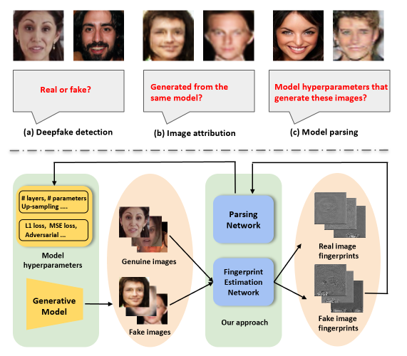

# <p align=center>`Model Parsing (IEEE TPAMI)`</p>
Official Pytorch implementation of our **T-PAMI** paper "Reverse Engineering of Generative Models: Inferring Model Hyperparameters from Generated Images".

The paper and supplementary can be found at [Arxiv](https://arxiv.org/abs/2106.07873) 

> **Authors:** 
> [Vishal Asnani](https://vishal3477.github.io/), 
> [Xi Yin](https://xiyinmsu.github.io/), 
> [Tal Hassner](https://mmcheng.net/) &
> [Xiaoming Liu](https://www.cse.msu.edu/~liuxm/index2.html).

## 1. :fire: NEWS :fire:

- [2023/07/29] Our Paper is accepted to **Transactions on Pattern Analysis and Machine Intelligence**!!
- [2023/07/29] The version 3 of the code is released!
- [2022/06/30] The version 2 of the code is released!
- [2021/06/15] In collaboration with Meta AI, our model parsing work is widely reported in [CNBC](https://www.cnbc.com/2021/06/16/facebook-scientists-say-they-can-tell-where-deepfakes-come-from.html), [CNET](https://www.cnet.com/news/privacy/facebook-steps-up-efforts-to-study-deepfakes/?PostType=link&ServiceType=twitter&TheTime=2021-06-16T16%3A03%3A06&UniqueID=5656784E-CEBC-11EB-BC13-31D94744363C&ftag=COS-05-10aaa0b), [Engadget](https://www.engadget.com/facebooks-latest-ai-detects-deep-fakes-and-knows-where-they-came-from-160012532.html), [Fortune](https://fortune.com/2021/06/16/facebook-detecting-deepfakes-research-michigan-state/), [The Mac Observer](https://www.macobserver.com/news/facebook-msu-deepfake-detection/), [MSU Today](https://msutoday.msu.edu/news/2021/deepfake-detection), [New Scientist](https://www.newscientist.com/article/2281198-facebook-ai-aims-to-identify-deepfake-images-and-trace-their-creators/), [SiliconAngle](https://siliconangle.com/2021/06/16/facebook-reverse-engineering-deepfakes-detect-ai-models-used-create/), [VentureBeat](https://venturebeat.com/business/facebooks-ai-reverse-engineers-models-used-to-generate-deepfakes/), [The Verge](https://www.theverge.com/2021/6/16/22534690/facebook-deepfake-detection-reverse-engineer-ai-model-hyperparameters), and [Wall Street Journal](https://www.wsj.com/articles/facebook-michigan-state-develop-deepfake-detection-technique-11623859200).

- [2021/05/06] Our codebase for model parsing is released is released!

## 2. Overview
<p align="center">
     <br />
</p>

## 3. Training/testing


### Prerequisites

- PyTorch 1.5.0
- Numpy 1.14.2
- Scikit-learn 0.22.2


### Datasets

We collect a large scale dataset comprising of fake images images genearted by 116 generative models. Please visit [link](https://github.com/vishal3477/Reverse_Engineering_GMs/blob/main/dataset/readme.md) for more details. 
For reverse enginnering: 
- Download the model parsing dataset and the ground truth files by following the instructions from [here](https://github.com/vishal3477/Reverse_Engineering_GMs/blob/main/dataset/readme.md). 
- For leave out experiment, put the training data in train folder and leave out models data in test folder
- For testing on custom images, put the data in test folder.

For deepfake detection:
- Download the CelebA/LSUN dataset

For image_attribution:
- Generate 110,000 images for four different GAN models as specified in https://github.com/ningyu1991/GANFingerprints/
- For real images, use 110,000 of CelebA dataset.
- For training: we used 100,000 images and remaining 10,000 for testing.

### Training
- Provide the train and test path in respective codes as sepecified below. 
- Provide the model path to resume training
- Run the code

For reverse engineering, run:
```
python reverse_eng.py
```

For deepfake detection, run: 
```
python deepfake_detection.py
```

For image attribution, run:
```
python image_attribution.py
```

### Testing using pre-trained models
- Provide the test path in respective codes as sepecified below
- Download the pre-trained models from https://drive.google.com/drive/folders/1bzh9Pvr7L-NyQ2Mk-TBSlSq4TkMn2anB?usp=sharing
- Provide the model path in the code
- Run the code

For reverse engineering, run:
```
python reverse_eng_test.py
```
For deepfake detection, run: 
```
python deepfake_detection_test.py
```
For image attribution, run: 
```
python image_attribution_test.py
```

If you would like to use our work, please cite:
```
@misc{asnani2023reverse,
      title={Reverse Engineering of Generative Models: Inferring Model Hyperparameters from Generated Images}, 
      author={Vishal Asnani and Xi Yin and Tal Hassner and Xiaoming Liu},
      journal={IEEE Transactions on Pattern Analysis and Machine Intelligence},
      year={2023}
}
```
